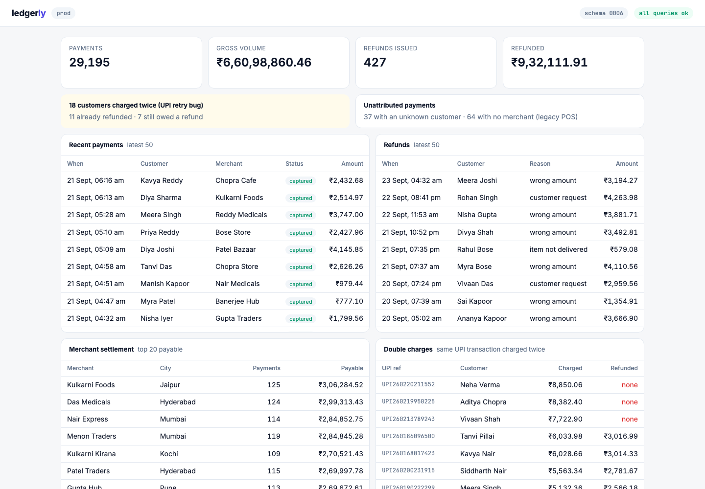

# ledgerly

A small **UPI payments ledger** with a live operations dashboard. It records customers, merchants, payments and refunds, and shows what the business looks like right now: gross volume, refunds, merchant settlement, double charges and payments that can't be attributed.



ledgerly is the demo app for **[Migration Rehearsal](https://github.com/dipakkr/truefoundry-hackathon)**, an agent on TrueForge that rehearses every database migration PR on a masked copy of production before it can reach prod. Its "prod" data is realistic and a little messy, like any ledger that has been running for a while.

## What's in the app

| Page element | What it shows | Query |
|---|---|---|
| KPI tiles | Payments, gross volume, refunds issued, amount refunded (₹, en-IN) | `src/queries/dashboard_totals.sql` |
| Double charges | Customers charged twice for the same UPI transaction, and whether they were refunded | `src/queries/double_charges.sql` |
| Unattributed payments | Payments with an unknown customer or no merchant | `src/queries/unattributed_payments.sql` |
| Recent payments | Latest 50, with customer, merchant and status | `src/queries/recent_payments.sql` |
| Refunds | Latest 50, with reason and customer | `src/queries/customer_refunds.sql` |
| Merchant settlement | What each merchant is owed: captured minus refunded | `src/queries/merchant_settlement.sql` |

- The page refreshes every 3 seconds. If a number changes after you opened it, the tile turns red and shows the delta; if refund records disappear, a red alert says how many and how much money they covered.
- The header shows the schema version (`schema_migrations`) and whether every query still runs ("all queries ok" / "N queries failing").
- **The UI runs exactly the SQL files in `src/queries/` and nothing else**, so a migration rehearsal that replays those files is testing precisely what the app depends on.

## Data model

```
customers (8,000)          merchants (300)
  id, full_name, email,      id, name, category, city
  phone, upi_id, pan              │
        ▲                         │ merchant_id (nullable: legacy POS)
        │ customer_id (no FK yet) ▼
        └──────────────── payments (30,055)
                            id, customer_id, merchant_id, amount numeric(12,2),
                            status: captured | refunded | failed, upi_txn_ref
                                  ▲
                                  │ payment_id  ON DELETE CASCADE
                            refunds (427)
                              id, payment_id, amount, reason
```

Migrations live in `migrations/` (`0001` to `0006`) and are recorded in `schema_migrations`.

### Known data quirks in prod
Real ledgers carry history. ledgerly's does too, which is why schema changes have to be tested against real data, not an empty database:

- **18 double charges** from a UPI retry bug: the same `upi_txn_ref` charged twice, a few seconds apart. 11 of them were already refunded, on the duplicate payment.
- **37 payments** belong to customer accounts deleted in an old cleanup (there is no customer FK yet).
- **64 payments** came from the legacy POS integration, which didn't send a merchant.
- Refunds are deleted with their payment (`ON DELETE CASCADE`), so anything that deletes payments deletes refund history with it.

## Run it locally

You need Node 22.14+ and a Postgres 16 database to play "prod".

```bash
cp .env.example .env     # DATABASE_URL=postgres://.../ledgerly, PORT=8800
npm install
npm run reset            # builds prod: migrations 0001-0006 + realistic data (same data every run)
npm start                # http://localhost:8800
```

No Postgres handy? `docker run -d --name ledgerly-pg -e POSTGRES_PASSWORD=dev -e POSTGRES_DB=ledgerly -p 55432:5432 postgres:16`

| Script | What it does |
|---|---|
| `npm run reset` | Drops and rebuilds the prod schema and data in under a second. Deterministic: fixed seed, fixed clock, explicit ids. |
| `npm start` | The ledger UI on `PORT` (default 8800). |
| `npm run deploy:unsafe -- <file.sql>` | Deploys a migration the way many teams do: statement by statement, no rehearsal, no transaction around the file. Statements that succeed stay applied even when a later one fails, and it prints what changed in prod. Use it to see what a bad migration does without a safety net. |

## Migrations and CI

Every pull request runs the **Migration Rehearsal** workflow (`.github/workflows/migration-rehearsal.yml`, on a self-hosted runner next to TrueForge):

- **PRs that change `migrations/`** are rehearsed by the `migration-rehearsal-ledgerly` agent on a masked, full copy of prod. The agent fixes what breaks, and a human approves the apply in TrueForge. Progress shows as the **Migration Rehearsal / prod data** check, with a link to the live trace.
- **Other PRs** pass the check in seconds ("No migration changes").
- `main` requires that check, admins included: a migration PR can only merge once it was rehearsed, approved, applied and verified on prod.
- `payments` and `refunds` are **protected**: no migration may delete their rows, even with approval.
- Customer PII (name, email, phone, UPI id, PAN) is masked in every copy that leaves prod.

A migration PR paused in TrueForge, waiting for a human to allow or deny the apply to prod:


The project was connected with one command from the Migration Rehearsal repo: `npm run onboard -- --project ledgerly --repo dipakkr/ledgerly`.

## Licence

MIT
